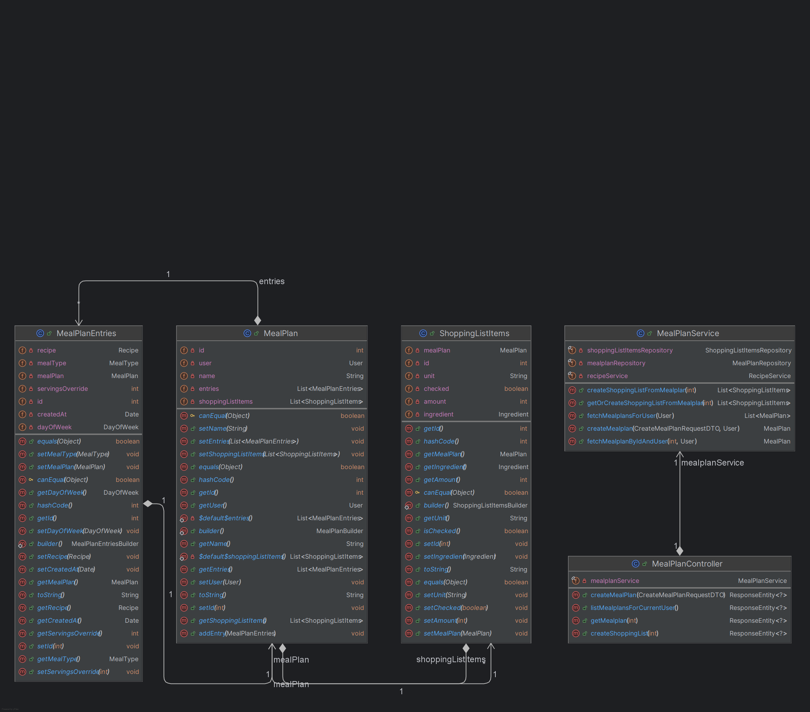

# MealFlow

Backend for a personal meal planning and shopping list app.

MealFlow lets you:

- Create and manage recipes
- Build weekly meal plans
- Generate shopping lists from those plans
- Secure everything with JWT authentication

> Status: Work in progress / learning project

---

## Table of Contents

- [Tech Stack](#tech-stack)
- [Features](#features)
- [Architecture](#architecture)
- [Getting Started](#getting-started)
  - [Prerequisites](#prerequisites)
  - [Clone and build](#clone-and-build)
  - [Database setup](#database-setup)
  - [Configuration](#configuration)
- [API Overview](#api-overview)
- [Future Work](#future-work)

---

## Tech Stack

- Java 21
- Spring Boot 3
- Spring Security + JWT
- JPA / Hibernate
- MySQL
- Maven
- Docker (optional dev setup)

---

## Features

### Implemented

- User registration and login (JWT based)
- CRUD for recipes
- Add ingredients to recipes (name, amount, unit)
- Create weekly meal plans:
  - Choose date
  - Choose meal type (breakfast / lunch / dinner)
  - Link to recipes
- Generate shopping lists from a meal plan
- Auto-merge ingredient quantities across recipes when generating the shopping list

---

## Visual overview

Diagrams are located in `src/main/resources/diagrams`.

### Meal plan model (used in presentation)

This is the simplified model used for presentations and to explain the core flow from meal plan to shopping list.



### Other diagrams

Additional diagrams in `src/main/resources/diagrams` show:

- Recipe and ingredient relationships
- Shopping list items
- The overall domain model

You can open them directly from the repository to get a full picture of the backend.

---

## Architecture

The project follows a classic layered architecture:

```text
Controller → Service → Repository → Database
